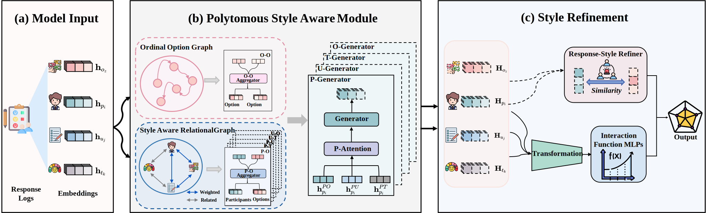

<div align="center">

# A Style-Aware Polytomous Diagnostic Model for Individual Traits

**Yixuan Wang<sup>a</sup>, Jiale Feng<sup>a</sup>, Yue Huang<sup>a</sup>, Xuruo Pan<sup>a</sup>,
Zhongjing Huang<sup>b, *</sup>, Zhi Liu<sup>a, c</sup> and
Hong Qian<sup>a, d, *</sup>**<br>
<small>(*Corresponding authors)</small><br>
<sup>a</sup> Shanghai Institute of AI for Education, East China Normal University, Shanghai, China<br>
<sup>b</sup> Faculty of Education, East China Normal University, Shanghai, China<br>
<sup>c</sup> Shanghai Innovation Institute, Shanghai, China<br>
<sup>d</sup> Key Laboratory of Advanced Theory and Application in Statistics and Data Science-MOE, East China Normal University, Shanghai, China

<a href='https://github.com/yxwang19/SAPD'></a>
<a href='paper/main.pdf'></a>


</div>
<!-- markdown break: force parser to end html block -->

🎉 Welcome to SAPD, this is a comprehensive repository specializing in
**A Style-Aware Polytomous Diagnostic Model for Individual Traits**  
published in ECAI 2025.

## 🔔 Abstract
Diagnostic models aim to precisely infer individuals' cognitive or non-cognitive competencies from their response logs, such as mathematical or social-emotional skills. While deep learning shows success in cognitive diagnosis, it remains underexplored in the equally important area of non-cognitive trait diagnosis. Accurate non-cognitive trait estimation is critical for individuals' development. Unlike cognitive assessments using right or wrong responses, non-cognitive trait assessments typically use subjective Likert-scale items with ordinal polytomous options to reflect latent trait levels. Furthermore, individual response styles, such as tendencies toward higher or lower options, introduce bias in trait inference, causing estimations that deviate from true trait levels. Thus, maintaining options ordinal semantic structure and mitigating the response style bias in trait estimation are two major challenges for accurate trait diagnosis. To address these issues, this paper proposes a Style-Aware Polytomous Diagnosis (SAPD) model. Specifically, to capture the ordinal semantics of response options, SAPD constructs an Ordinal Option Graph (OOG) that explicitly encodes the ordinal relationship among polytomous options, where higher options reflect higher latent trait levels. To mitigate the bias caused by individual response styles, we first design a Style-Aware Relational Graph (SARG), a heterogeneous graph that integrates multiple interactions among participants, items, options and traits, implicitly embedding response style information within node representations. We then propose a Response Style Corrector (RSC) that explicitly captures individual response tendencies and disentangles response style bias during trait diagnosis, allowing for dynamic and adaptive correction of trait levels. Extensive experiments on five real-world datasets show that SAPD improves accuracy by an average of 4% over competitive methods. Visualization confirms SAPD effectively disentangles response style effects, leading to more accurate and interpretable trait diagnosis.

## 🎓 Architecture
 <div align="center">


</div>
To model the ordinal nature of Likert-scale responses, SAPD introduces the Ordinal Option Graph (OOG), which explicitly encodes the ordered relationships among options. To address individual response style bias, SAPD incorporates two complementary components: the Style-Aware Relational Graph (SARG), which implicitly encodes personalized patterns through high-order interactions, and the Response Style Corrector (RSC), which explicitly adjusts for style bias during inference. We also detail the training objective, including the composite loss and optimization strategy.

## 📖 Requirements
```shell
dgl==1.1.0+cu118
numpy==2.2.5
pandas==2.2.3
scikit_learn==1.6.1
scipy==1.15.2
torch==2.0.0+cu118
tqdm==4.67.1
swanlab=0.6.6
numpy==1.23.5
pandas==1.5.2
EduCDM==0.0.13
```
 

## 🚀 Getting Started
### Installation
Git and install with pip:
```
git clone https://github.com/ECNU-ILOG/inscd.git
cd <path of code>
pip install -e .
```
### Quick Example
The following is a reference command. If you interested in other parameter of command,you can look into the main.py for more detail.
```
python main.py --method=sapd --datatype=OECDSuzhou --test_size=0.2 --seed=0 --device=cuda:1 --epoch=10 --batch_size=1024 --lr=0.003 --option_num=5 --gnn_type=LightGCN
```
or
```
python main.py --method=sapd --datatype=OECDSuzhou --test_size=0.2 --seed=0 --device=cuda:1 --epoch=10 --batch_size=1024 --lr=0.003 --option_num=5 --gnn_type=GraphSAGE
```

## 👏 Experiment
We use swanlab to visualization our experiment result.  
If you prefer not to use it,you can add --swanlab=False in your command to disable swanlab.

## 💭 Reference 
Yixuan Wang, Jiale Feng, Yue Huang, Xuruo Pan, Zhongjing Huang, Zhi Liu and Hong Qian "A Style-Aware Polytomous Diagnostic Model for Individual Traits." In Proceedings of the 28th European Conference on Artificial Intelligence (ECAI), 2025.

## Bibtex
```bibtex
@inproceedings{wang2025ecai,
author = {Yixuan Wang, Jiale Feng, Yue Huang, Xuruo Pan, Zhongjing Huang, Zhi Liu and Hong Qian},
booktitle = {Proceedings of the 28th European Conference on Artificial Intelligence},
title = {A Style-Aware Polytomous Diagnostic Model for Individual Traits},
year = {2025},
address={Bologna, Italy}
}


